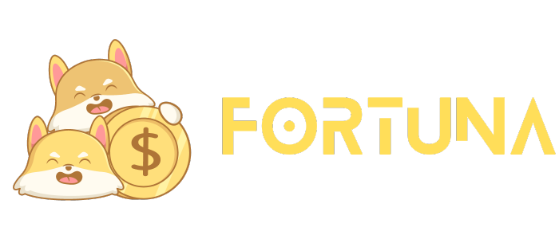

  

<h1 align="center" >Fortuna: Redifining Gifting </h1>

  

Fortuna, your gateway to modern gifting, revolutionizes the age-old tradition of giving with its innovative digital red envelope platform. By seamlessly blending tradition with technology, Fortuna allows users to create, share, and experience the joy of giving in the digital age. With Fortuna, you can personalize your gifts, add an element of surprise, and enhance the entire gifting experience by incorporating various digital assets, all in one secure and user-friendly platform
 

## ✨ Features

Gift Pool Creation: Users can deposit a chosen total value of digital assets into a gift pool.

Purpose and Link Creation: Senders specify the purpose of the red envelope and generate a unique link.

Link Distribution: Senders can easily share the unique link with intended recipients.

NFT Security: An optional feature allows senders to secure the process using NFTs for added protection and exclusivity.

Recipient Engagement: Recipients follow the link to access the gift pool and experience the gifting process.

Randomized Prizes: Recipients are presented with randomized prizes upon entering the gift pool, adding an exciting element of surprise.

Claiming the Gift: Recipients can easily claim their prizes with a simple and user-friendly "claim" process.

Contribution Option: Recipients have the choice to contribute additional digital assets to the gift pool, enhancing the overall value before passing it on to others.

Transparency and Ledger: Maintain a transparent and immutable ledger of all red envelope transactions, providing users with a complete history of distributions.

Multi-Asset Support: Fortuna accommodates various digital assets, including cryptocurrencies and NFTs, offering a diverse range of gifting options.

Security and Tamper Resistance: The platform ensures the security and tamper resistance of the gift pool and its contents.

User-Friendly Interface: A user-friendly interface simplifies the gifting and claiming process, making it accessible to users of all backgrounds.

Mobile Accessibility: Users can access and engage with Fortuna through mobile devices, ensuring convenience and flexibility.

Personalization: Senders can personalize the red envelope by specifying its purpose and contents, making each gift unique.

Additional Gifting Features: Fortuna may include additional features such as virtual spinner games and leaderboards to enhance the gifting experience.

 
## ✅ How Fortuna Works

Fortuna, our innovative digital red envelope platform, introduces an engaging and seamless process for digital gifting. It commences with the sender depositing a specified total value of digital assets, which can encompass cryptocurrencies, NFTs, and an array of digital assets, forming the foundation of a dynamic gift pool. Adding a personal touch to the gifting experience, the sender customizes the gift by specifying its purpose, and Fortuna generates a unique link associated with the gift pool, ensuring each gift is distinct and memorable. The sender shares this unique link with the intended recipients, granting them access to the gift pool, which may be further secured through the optional use of a non-fungible token (NFT) to add an extra layer of security and exclusivity. Recipients, upon receiving the unique link, are drawn into the immersive Fortuna platform, unveiling a world of digital surprises. The heart of the experience lies in the revelation of randomized prizes within the gift pool, injecting an element of unpredictability and excitement, enhancing the joy of gifting. The process for recipients to claim their prizes is streamlined through the Fortuna platform, featuring a user-friendly "claim" button for a hassle-free experience. Moreover, Fortuna fosters a spirit of generosity as recipients have the choice to contribute additional digital assets to the gift pool, amplifying the overall value of the gift and enabling a ripple effect of generosity as the gift continues to circulate among others. This combination of customization, security, engagement, and surprise ensures Fortuna is at the forefront of modern digital gifting, revitalizing the tradition of gift-giving in the digital age.

 

 

## 🌱 Contributing

Developers and emergency services professionals who are interested in enhancing the Fortuna system are encouraged to contribute. To get involved, simply fork the repository and submit a pull request with your proposed changes. We value your contributions and appreciate your efforts in making Fortuna even more effective in emergency situations. Together, we can continually improve and optimize the system to better serve the needs of emergency services and the communities they protect.
 